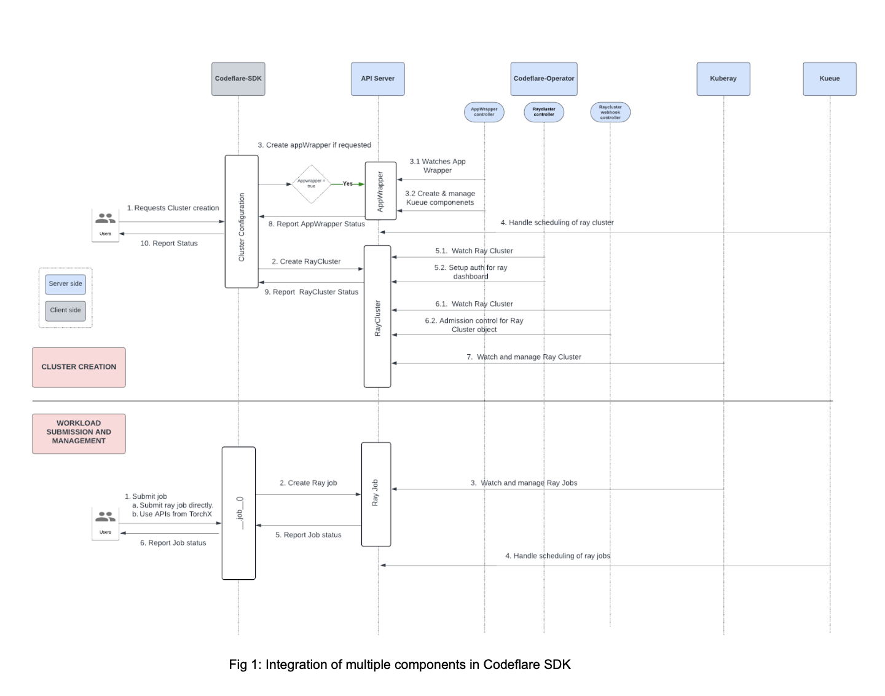
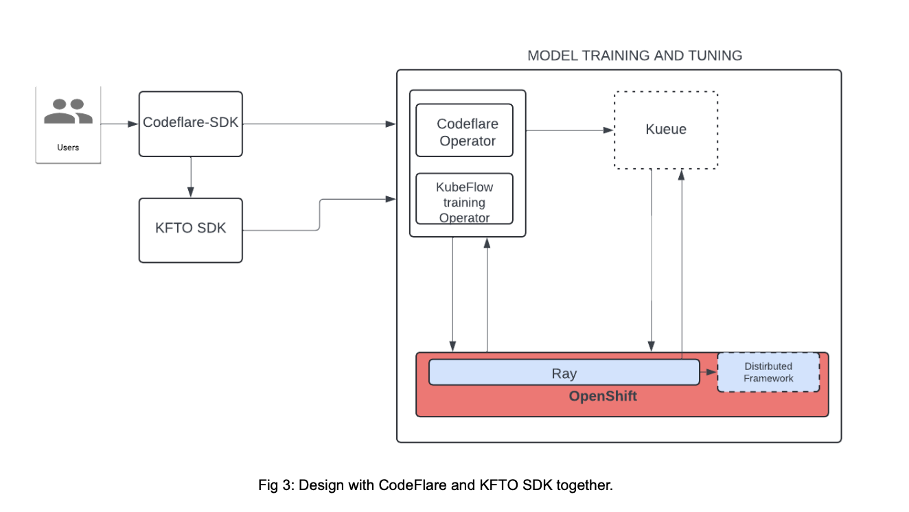

# CodeFlare SDK Design Document

Team: Distributed Workloads - Orchestration
Implementation History:
- 2024-10-07: Initial revision

## Introduction

This document outlines the design of the Project CodeFlare SDK, a Python SDK that facilitates interactions between users and the distributed workloads component of Red Hat OpenShift AI(RHOAI)/ OpenDataHub(ODH). Users, in this instance, are both data scientists and MLOps Engineers. The SDK provides a high-level abstraction for managing machine learning(ML) workflows, jobs and distributed computing resources.

This document should be followed when adding new functionality along with being updated as the design evolves.

## Objectives

1. Provide a Pythonic, user-friendly interface for interaction with distributed workloads components.
2. Integrate with Kueue for managing workload queues, quota management, job orchestration and scheduling.
3. Provide separate functionalities for data scientists/ MLops engineers and platform administrators.
4. Allow data scientists to manage ML workflows, workloads and jobs.
5. Leverage Ray and Kubeflow for workloads and jobs.
6. Ensure extensibility to accommodate future integrations with other tools and frameworks.
7. Follow best practices in codebase to make it easier for developers to maintain the project.

## Architecture

### CodeFlare stack components overview:

1. [CodeFlare SDK][codeflare_sdk_gh]: Primary user-facing component, offering a Python-native interface that bridges users with the underlying services in the stack. This SDK abstracts away much of the complexity, providing a unified and accessible method for submitting and managing the running of distributed AI workloads on OpenShift clusters.

2. [CodeFlare Operator][codeflare_operator_gh]: Manages the platform requirements for the running of the CodeFlare components:
   1. Ensuring necessary configurations are present on cluster to enable access to Ray dashboards (includes ingress and cert management).
   2. Validate and mutate Ray cluster/AppWrapper CRUD requests (admission policy).
   3. Creates Ray related Routes/Ingresses based on if the environment is OpenShift/Kubernetes.

3. [AppWrapper][appwrapper_gh]: AppWrapper groups multiple Kubernetes resources into a single, logical workload for easier management. It is integrated with Kueue and accepts the k8s components to be created and managed through a template in the spec which is untyped in the form of RawExtension.

4. [KubeRay][kuberay_gh]: Operator designed specifically for managing and orchestrating Ray clusters on Kubernetes. It automates the creation and lifecycle management of Ray clusters and jobs, ensuring that they can scale and operate efficiently on K8s. KubeRay also provides a Python client library, enabling developers and data scientists to interact with Ray components directly within their applications.

5. [Kueue][kueue_gh]: Batch workload queuing and scheduling system designed to optimize resource allocation in K8s clusters. It ensures that Ray Clusters are only scheduled when sufficient resources are available, preventing resource contention and maximizing cluster efficiency. This component plays a critical role in balancing resource availability with the demand for distributed workloads, facilitating efficient job execution.

On a high level, the interaction between a data scientist, CodeFlare SDK and the rest of the components are explained as below:



The role of the SDK in the model training and tuning stack remains consistent on the client side, regardless of any changes to the components it interacts with on the cluster.



#### Considerations while designing SDK:

1. Ease of use and integration: The SDK’s primary role is to abstract Kubernetes specifics. It should provide simple interfaces for interacting with any of the model training components on the server side.
2. Lightweight: The SDK runs client-side and should minimize resource consumption. It must prioritize responsiveness and user experience. For example, using a polling mechanism to fetch status instead of a constant resource watch.
3. Extensibility: The SDK currently integrates well with the CodeFlare stack, which uses Ray and TorchX (pytorch) distributed framework. In the future, components used for distributed training/tuning (as seen in fig [2]) should remain interchangeable.
4. Security: The SDK must ensure users see only the information they are authorized to view. Authentication occurs on the client, while admission and validation are handled server-side. Kubernetes RBAC makes things easier.
5. Typed Object Creation: The client should only allow the creation of known, typed K8s resources. This prevents arbitrary payloads from reaching the server which could be a threat. (configuring AppWrapper resource template is a concern here).
6. Version Compatibility: The SDK must maintain compatibility between client and server versions. Backward compatibility should be ensured even if one side is upgraded.

#### Codebase Modularization:

The CodeFlare-SDK codebase requires refactoring and modularization to facilitate easier addition or removal of components. The key requirements for this refactor include:

1. Component Structure: The SDK will be divided into distinct components:
   - Modules for commands, helpers, and utilities that interact with Kubernetes (OpenShift) clusters.
   - Helpers specific to framework clusters like Ray.
2. Self-Contained Packages: Each Python package will function as an independent, self-contained module with its own dedicated functionality. This will make it easier to manage, maintain, and extend the SDK.
3. Testing: Unit tests for each API will be located within their respective submodules to ensure:
   - Comprehensive test coverage, closely tied to the implementation, facilitating easier association between code and tests.
   - Integration and upgrade tests that span multiple modules will be managed separately, ensuring robust validation of both individual and end-to-end functionality.

The overall codebase would be structured as below:

```
codeflare_sdk/
├── build/
│   ├── requirements.txt
│   ├── Dockerfile
│   └── image_stream.yaml
├── docs/
│   ├── design_docs/
│   ├── target_user_docs/
├── examples/
│   ├── guided_demos/
│   └── additional_demos/
├── src/
│   └── codeflare_sdk/
│       ├── common/
│       |   ├── kubernetes_cluster/
│       |   │   ├── __init__.py
│       |   │   ├── auth.py
│       |   │   ├── test_auth.py
│       |   ├── kueue/
│       |   │   ├── __init__.py
│       |   │   ├── kueue.py
│       |   │   └── test_kueue.py
│       |   ├── widgets/
│       |   │   ├── __init__.py
│       |   │   ├── widgets.py
│       |   │   └── test_widgets.py
│       |   ├── utils/
│       |   │   ├── __init__.py
│       |   │   ├── utils.py
│       |   │   └── test_utils.py
│       ├── ray/
│       │   ├── cluster/
│       │   ├── client/
│       │   ├── appwrapper/
├── tests/
│   ├── e2e/
│   └── upgrade/
├── poetry.lock
└── pyproject.toml
```

### Client side best practices:

1. The SDK should perform client-side validation of user inputs before sending them to the API server, to the extent possible. These validations should be limited to client-side checks, and the SDK is not responsible for performing validations that require server-side data. The SDK does not need to maintain the state of server-side objects. Examples of client-side validations include verifying user inputs, validating YAML schemas, and checking resource requests/limits based on available data.
2. Any call made to the server should have a client instance passed through it. By default, the SDK should use the same client for all operations unless otherwise specified. For example, the client used to list clusters should also be used to fetch cluster details. The codebase should be designed so that these operations are either methods of the same client (e.g., a k8s client, RayJob client, TrainingClient) or the client instance is passed as an argument to the methods.
3. Errors returned from the API server, to the extent possible, should be wrapped and handled explicitly.

## Release:

A new version of CodeFlare SDK will be released once every three weeks.
For details on the release support matrix with other CodeFlare components, refer [here][codeflare_compatibility_matrix].

RHOAI support matrix: CodeFlare SDK APIs fall under [Tier 2][RH_customer_API_support] support on `RHOAI` platform. This implies than an API would be support for `n-1` major versions for a minimum of 9 months.

## Security:

// TODO

## Documentation and Examples:

The following are the documentation sources for users which will need to remain updated:
1. Upstream documentation - includes `README` and examples in `docs/` folder.
2. Demo notebooks - The NBs which are to be tested and updated to ensure that they are upto date with the most recent changes.
3. For RHOAI customers - [Official documentation][DW_RHOAI_docs].

[codeflare_sdk_gh]: https://github.com/project-codeflare/codeflare-sdk
[codeflare_operator_gh]: https://github.com/project-codeflare/codeflare-operator
[appwrapper_gh]: https://github.com/project-codeflare/appwrapper
[kuberay_gh]: https://github.com/ray-project/kuberay
[kueue_gh]: https://github.com/kubernetes-sigs/kueue
[codeflare_compatibility_matrix]: https://github.com/project-codeflare/codeflare-operator?tab=readme-ov-file#codeflare-operator
[RH_customer_API_support]: https://access.redhat.com/articles/7047935
[DW_RHOAI_docs]: https://docs.redhat.com/en/documentation/red_hat_openshift_ai_self-managed/2-latest/html-single/working_with_distributed_workloads/index
