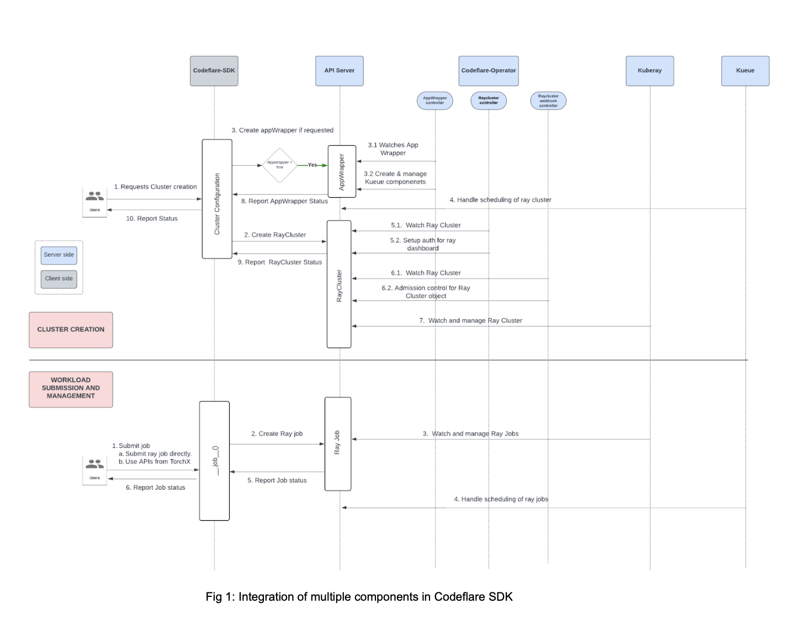

# CodeFlare SDK Design Document

Author: [@varshaprasad96](https://github.com/varshaprasad96)

## Introduction
This document outlines the design of the Project CodeFlare SDK, a Python SDK that facilitates interactions between users and the distributed workloads component of Red Hat OpenShift AI(RHOAI)/ OpenDataHub(ODH). Users, in this instance, are both data scientists and MLOps Engineers. The SDK provides a high-level abstraction for managing machine learning(ML) workflows, jobs and distributed computing resources.

This document should be followed when adding new functionality along with being updated as the design evolves.

## Objectives
1. Provide a Pythonic, user-friendly interface for interaction with distributed workloads components.
2. Integrate with Kueue for managing workload queues, quota management, job orchestration and scheduling.
3. Provide separate functionalities for data scientists/ MLops engineers and platform administrators.
4. Allow data scientists to manage ML workflows, workloads and jobs.
5. Leverage Ray and [Kubeflow][Kubeflow] for workloads and jobs.
6. Ensure extensibility to accommodate future integrations with other tools and frameworks.
7. Follow best practices in the codebase to make it easier for developers to maintain the project.

## Architecture

### CodeFlare stack components overview:
1. [CodeFlare SDK][codeflare_sdk_gh]: Primary user-facing component, offering a Python-native interface that bridges users with the underlying services in the stack. This SDK abstracts away much of the complexity, providing a unified and accessible method for submitting and managing the running of distributed AI workloads on Kubernetes clusters.

2. [CodeFlare Operator][codeflare_operator_gh]: Manages the platform requirements for the running of the CodeFlare components:
   1. Ensuring necessary configurations are present on cluster to enable access to Ray dashboards (includes ingress and cert management).
   2. Validate and mutate Ray cluster/AppWrapper CRUD requests (admission policy).
   3. Creates Ray related Routes/Ingresses based on if the environment is OpenShift/Kubernetes.

3. [AppWrapper][appwrapper_gh]: AppWrapper groups multiple Kubernetes resources into a single, logical workload for easier management. It is integrated with Kueue and accepts the k8s components to be created and managed through a template in the spec which is untyped in the form of RawExtension.

4. [KubeRay][kuberay_gh]: Operator designed specifically for managing and orchestrating Ray clusters on Kubernetes. It automates the creation and lifecycle management of Ray clusters and jobs, ensuring that they can scale and operate efficiently on K8s. KubeRay also provides a Python client library, enabling developers and data scientists to interact with Ray components directly within their applications.

5. [Kueue][kueue_gh]: Batch workload queuing and scheduling system designed to optimize resource allocation in K8s clusters. It ensures that Ray Clusters are only scheduled when sufficient resources are available, preventing resource contention and maximizing cluster efficiency. This component plays a critical role in balancing resource availability with the demand for distributed workloads, facilitating efficient job execution.

At a high level, the interaction between a data scientist, CodeFlare SDK and the rest of the components are explained below:



The role of the SDK in the model training and tuning stack remains consistent on the client side, regardless of any changes to the components it interacts with on the cluster.


#### Considerations while designing SDK:
1. Ease of use and integration: The SDK’s primary role is to abstract Kubernetes specifics. It should provide simple interfaces for interacting with any of the model training components on the server side.
2. Lightweight: The SDK runs client-side and should minimize resource consumption. It must prioritize responsiveness and user experience. For example, using a polling mechanism to fetch status instead of a constantly watching resources.
3. Extensibility: The SDK currently integrates well with the CodeFlare stack, which uses Ray and the TorchX (pytorch) distributed framework. In the future, components used for distributed training/tuning (as seen in figure [2]) should remain interchangeable.
4. Security: The SDK must ensure users see only the information they are authorized to view. It's the responsibility of the SDK to generate an authenticated request by attaching the right credentials/token during every API call.
5. Typed Object Creation: The client, to the extent possible should allow the creation of known, typed K8s resources. This prevents arbitrary payloads from reaching the server which could be a threat.
6. Release Versioning: The SDK adheres to the Semantic Versioning format and should follow the specifications outlined in the [SemVer standard][semver_std].
7. Version Compatibility: The SDK must maintain compatibility between client and server versions. Backward compatibility should be ensured even if one side is upgraded.

#### Codebase Modularization:
The CodeFlare-SDK should adopt a modular architecture to support the seamless addition and modification of components. The project structure must meet the following key requirements:

1. Component Structure: The SDK should consist of clearly separated components to promote maintainability and scalability. For example:
   - Distinct Python packages should be created for command modules, helpers, and utilities that interface with Kubernetes (OpenShift) clusters.
   - Separate packages should be defined for framework-specific clusters, such as Ray.
2. Self-Contained Packages: Each Python package should function independently as a self-contained module, encapsulating dedicated functionality. This approach will simplify management, improve maintainability, and enable the SDK to evolve more efficiently.
3. Testing Framework:
   - Unit tests should be integrated within each submodule, ensuring comprehensive coverage that directly correlates with the corresponding code.
   - Integration and upgrade tests, which span multiple components, should be managed independently to validate both individual modules and the system’s end-to-end functionality.

An example of a modular structure would be:
```
codeflare_sdk/
├── build/
│   ├── requirements.txt         # Dependencies required for building the project.
│   ├── Dockerfile               # Docker configuration for containerizing the SDK.
│   └── image_stream.yaml        # YAML file for building and deploying OpenShift image streams.
├── docs/                        # Documentation files for guiding users and contributors. Includes design docs.
├── examples/                    # Demonstrative examples showcasing SDK usage.
│   ├── guided_demos/
│   └── additional_demos/
├── src/
│   └── codeflare_sdk/
│       ├── common/              # Self-contained modules shared across SDK components.
│       │   ├── kubernetes_cluster/ # APIs for interacting with K8s clusters (e.g., authentication).
│       │   │   ├── __init__.py
│       │   │   ├── file.py
│       │   │   └── test_test.py  # Unit tests contained in the same module.
│       │   ├── kueue/           # API interactions related to Kueue job queuing.
│       │   ├── widgets/         # Reusable UI components for visualization.
│       │   └── utils/           # General utility functions and helpers used across project.
│       ├── ray/                 # Framework-specific APIs for Ray clusters.
│       │   ├── cluster/         # Cluster management utilities for Ray.
│       │   ├── client/          # Ray client interaction modules.
│       │   └── appwrapper/
├── tests/                       # End-to-end and upgrade testing modules.
│   ├── e2e/
│   └── upgrade/
├── poetry.lock                  # Project configuration and dependency management (Poetry).
└── pyproject.toml

```

### Client side best practices:
1. The SDK should perform client-side validation of user inputs before sending them to the API server, to the extent possible. These validations should be limited to client-side checks, and the SDK is not responsible for performing validations that require server-side data. The SDK does not need to maintain the state of server-side objects. Examples of client-side validations include verifying user inputs, validating YAML schemas, and checking resource requests/limits based on available data.
2. Any call made to the server should have a client instance passed through it. By default, the SDK should use the same client for all operations unless otherwise specified. For example, the client used to list clusters should also be used to fetch cluster details. The codebase should be designed so that these operations are either methods of the same client (e.g., a k8s client, RayJob client, TrainingClient) or the client instance is passed as an argument to the methods.
3. Errors returned from the API server, to the extent possible, should be wrapped and handled explicitly.

## Test Coverage:
The project should aim to maintain reasonable test coverage to ensure code quality. Wherever possible, new lines of code should be accompanied by corresponding test cases. Reviewers are encouraged to exercise discretion when merging pull requests (PRs) that result in a drop in test coverage percentage compared to the current state. To aid in tracking coverage, external tools like Codecov can be integrated with the repository, allowing for easier monitoring and ensuring that the codebase maintains a robust level of test coverage over time.

## Release:
A new version of CodeFlare SDK will be released once every three weeks.
For details on the release support matrix with other CodeFlare components, refer [here][codeflare_compatibility_matrix].
RHOAI and ODH support matrix: CodeFlare SDK APIs fall under [Tier 2][RH_customer_API_support] support on `RHOAI` platform. This implies than an API would be support in for `n-1` major versions for a minimum of 9 months.

## Security:
Currently, users must manually manage mTLS certificates and re-authenticate Ray clients when connecting to Ray clusters, though the CodeFlare SDK offers helpers to streamline this process (as seen [here][cert_generation]). In the future, integration with a service mesh like Istio will automate mTLS setup and certificate management via a sidecar proxy, eliminating the need for manual certificate handling and client re-authentication.

### CVE Management:
We currently use two approaches for scanning CVEs:
1. Dependabot is enabled to automatically bump dependencies with CVE fixes in the upstream repository.
2. A downstream Snyk scanner is used to identify vulnerabilities.

Depending on the severity of the issue, fixes are prioritized, and a new release with the necessary patches is tagged within the following three-week release window.
To streamline the CVE management process, it is recommended to automate security scans across multiple branches in the upstream repositories. This ensures that the SDK version used with each Notebook release remains free from vulnerabilities throughout its support cycle.

## Documentation and Examples:
The following are the documentation sources for users which will need to remain updated:
1. Upstream documentation - includes `README` and examples in `docs/` folder.
2. Demo notebooks - The NBs which are to be tested and updated to ensure that they are up-to-date with the most recent changes.
3. For RHOAI/ODH customers - [Official documentation][DW_RHOAI_docs] will be updated after every release.

The API documentation for the users should be clear, up-to-date with any changes, and if possible be generated automatically using appropriate tools to ensure accuracy and consistency.

Implementation History:
- 2024-10-07: Initial revision

[Kubeflow]: https://www.kubeflow.org
[codeflare_sdk_gh]: https://github.com/project-codeflare/codeflare-sdk
[codeflare_operator_gh]: https://github.com/project-codeflare/codeflare-operator
[appwrapper_gh]: https://github.com/project-codeflare/appwrapper
[kuberay_gh]: https://github.com/ray-project/kuberay
[kueue_gh]: https://github.com/kubernetes-sigs/kueue
[codeflare_compatibility_matrix]: https://github.com/project-codeflare/codeflare-operator?tab=readme-ov-file#codeflare-operator
[RH_customer_API_support]: https://access.redhat.com/articles/7047935
[DW_RHOAI_docs]: https://docs.redhat.com/en/documentation/red_hat_openshift_ai_self-managed/2-latest/html-single/working_with_distributed_workloads/index
[cert_generation]: https://github.com/project-codeflare/codeflare-sdk/blob/main/src/codeflare_sdk/common/utils/generate_cert.py
[semver_std]: https://semver.org/#semantic-versioning-specification-semver
